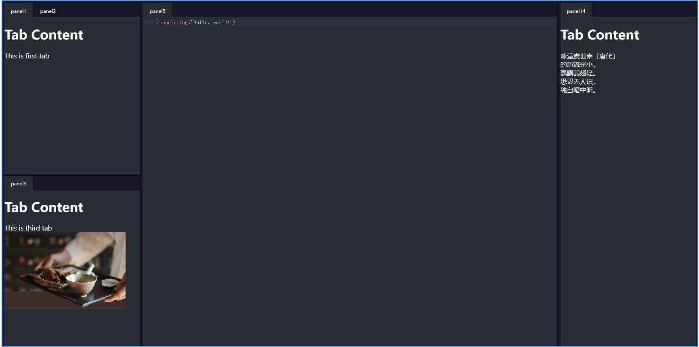

vue-dock-layout
---

一个Vue3的可拖拽网格布局组件(类似Visual studio)



---

[查看在线示例](https://imengyu.top/pages/vue-dock-layout-demo/)

**注：此项目已不再开发中。我们建议使用[vue-code-layout](https://github.com/imengyu/vue-code-layout)**

## 特性

* 体积小，易用
* 可自定义

### 安装

```
npm install -save @imengyu/vue-dock-layout
```

## 使用方法

### 先导入

```ts
import { DockLayout, DockLayoutInterface } from '@imengyu/vue-dock-layout';   
```

### 制作布局

要使用 vue-dock-layout ，你需要先在您的界面中添加一个容器组件，这是您的应用的内容承载区域。

```html
<template>
  <DockLayout ref="dockLayout" class="full">
    <template #panelRender="{ panel }">
      <template v-if="panel.key==='panel1'">
        <h1>Tab Content</h1>
        <span>This is first tab</span>
      </template>
      <template v-else-if="panel.key==='panel2'">
        <h1>Tab Content</h1>
        <span>This is second tab</span>
      </template>
      <template v-else-if="panel.key==='panel3'">
        <h1>Tab Content</h1>
        <span>This is third tab</span>
        
      </template>
    </template>
  </DockLayout>
</template>
```

布局组件的布局是以网格为布局方式的，每个分割区域为一个网格，网格中嵌入您的自定义内容。

组件提供了一些接口，允许您以编程方式快速设置界面布局：

```ts
const dockLayout = ref<DockLayoutInterface>();

onMounted(() => {
  nextTick(() => {
    //这里先设置界面布局
    //这里先添加了一个横向布局，中有三个区域，left/center/right，宽度占比为20%：60%：20%
    //然后left区域又被分割为了leftA/leftB两个区域，宽度为50%：50%
    dockLayout.value?.setData({
      name: 'root',
      size: 0,
      grids: [
        {
          size: 20,
          name: 'left',
          grids: [
            {
              size: 50,
              name: 'leftA',
            },
            {
              size: 50,
              name: 'leftB',
            },
          ]
        },
        {
          size: 60,
          name: 'center',
          //这里设置了中心区域没有面板时不会被自动移除
          alwaysVisible: true,
        },
        {
          size: 20,
          name: 'right',
        },
      ],
    });
    //下方代码向网格添加内容面板
    //每个内容面板以key作为标识符，在 DockLayout 的 panelRender 插槽中可以从 panel 参数中读取。
    dockLayout.value?.addPanels([
      {
        key: 'panel1',
        title: 'panel1',
      },
      {
        key: 'panel2',
        title: 'panel2',
      },
    ], 'leftA');
    dockLayout.value?.addPanels([
      {
        key: 'panel3',
        title: 'panel3',
      },
    ], 'leftB');
  })
});
```

以上示例可以在 [在线示例](https://imengyu.top/pages/vue-dock-layout-demo/) 中的第一个示例找到。

用户可以自定义拖拽界面。因此在程序离开时，如果您需要保存用户的自定义设置，可读取当前网格布局数据，
在下次程序加载时设置到组件中。

```js
onBeforeUnmount(() => {
  const layoutData = dockLayout.value?.getSaveData()
  //Save layoutData to anywhere...

  //Next time, load and set to dockLayout
  dockLayout.value?.setData(layoutData);
})
```

### 自定义

#### 主题

组件默认提供了 亮色（`light`）与 暗色 （`dark`）两个主题供您使用，主题可以使用 `DockLayout` 组件的 `theme` 属性指定。

```html
<DockLayout ref="dockLayout" theme="light">
  ...
</DockLayout>
```

两个主题效果如下图所示：

|light|dark|
|---|---|
|||

#### 自定义渲染

组件提供了一些位置的渲染插槽，你可以进行自定义渲染。

具体示例和源码请[查看在线示例](https://imengyu.top/pages/vue-dock-layout-demo/#/DockLayoutThemeTest)

##### tabItemRender

用于面板标题的自定义渲染。

```vue
<DockLayout ref="dockLayout" class="full">
  <template #tabItemRender="{ dockData, panel, onTabItemMouseDown, onTabItemDragStart, onTabItemDragEnd }">
    <div
      :class="'my-custom-tab drag-target-tab ' + (dockData.activeTab === panel ? 'active' : '')"
      draggable="true" 
      @mousedown="onTabItemMouseDown($event, panel)"
      @dragstart="onTabItemDragStart($event, panel)"
      @dragend="onTabItemDragEnd($event)"
    >
      {{ panel.title }}
    </div>
  </template>
</DockLayout>
```

##### emptyPanel

用于渲染面板没有内容面板时显示的底板。

```vue
<DockLayout ref="dockLayout" class="full">
  <template #emptyPanel="{ dockData }">
    <div>
      <h1>{{dockData.name}}</h1>
      <h1>This grid won't be removed from layout even when last Tab is closed</h1>
    </div>
  </template>
</DockLayout>
```

## API 参考

DockLayout 是布局组件的主要容器。

##### Props

| 属性 | 描述 | 类型 | 默认值 |
| :----: | :----: | :----: | :----: |
| tabHeight | Tab组件的高度，用于相关计算 | `number` | 40 |
| startVerticalDirection | 第一个布局网格是不是垂直的 | `boolean` | `false` |
| allowFloatWindow | 是否允许浮动窗口 | `boolean` | `false` |
| theme | 主题，可选 'light', 'dark' | `string` | `dark` |

##### Events

| 事件名 | 描述 | 参数 |
| :----: | :----: | :----: |
| active-tab-change | 当激活的内容面板更改时触发事件 | `currentActive : DockPanel|null`,`lastActive : DockPanel|null` |
| tab-closed | 内容面板关闭时触发此事件 | `panel: DockPanel` |

##### Slots

| 插槽名 | 描述 | 参数 |
| :----: | :----: | :----: |
| emptyPanel | 用于面板标题的自定义渲染 | { name: string, dockData: DockData } |
| tabItemRender | 用于渲染网格没有内容面板时显示的底板 | DockTabItemRenderData |

##### 方法

```ts
//使用ts时，可以使用 DockLayoutInterface 来获得代码提示
const dockLayout = ref<DockLayoutInterface>();
```
###### `getSaveData() : IDockGrid`

说明：

获取当前界面网格布局数据

返回值：

界面网格布局数据

###### `setData(data: IDockGrid) : void`

说明：

设置界面网格布局数据

| 参数 | 描述 |
| :----: | :----: |
| data | 网格数据 |

###### `updatePanel(panel: IDockPanel) : void`

说明：

更新面板实例的属性

| 参数 | 描述 |
| :----: | :----: |
| panel | 面板 |

###### `addPanel(panel: IDockPanel, insertTo?: string|DockData) : void`

说明：

向容器内插入面板。

* 注意：如果面板key已经插入当前容器，并且 `insertTo` 不为空，则会进行移动此面板至操作，新panel属性不会变化，需要手动调用 `updatePanel` 进行更新属性操作。
* 注意：如果 `insertTo` 不为空，则它的网格容器必须先存在，否则会添加失败。
* panel.key 不可为空。

| 参数 | 描述 |
| :----: | :----: |
| panel | 面板 |
| insertTo | 将面板插入指定名称的网格，为空则插入至顶级网格 |

###### `addPanels(panels: IDockPanel[], insertTo?: string|DockData) : void`

说明：

向容器内插入面板。同 `addPanel`，只不过此函数一次性添加多个面板。

| 参数 | 描述 |
| :----: | :----: |
| panels | 面板数组 |
| insertTo | 将面板插入指定名称的网格，为空则插入至顶级网格 |

###### `removePanel(key: string) : void`

说明：

移除指定的面板

| 参数 | 描述 |
| :----: | :----: |
| key | 面板唯一Key |

###### `removePanels(keys: string[]) : void`

说明：

移除多个指定的面板

| 参数 | 描述 |
| :----: | :----: |
| keys | 面板唯一Key |

###### `activePanel(key: string) : void`

说明：

激活指定的面板

| 参数 | 描述 |
| :----: | :----: |
| key | 面板唯一Key |

## 支持

作者开发不易，如果这个项目对您有帮助，希望你可以帮我点个 ⭐ ，这将是对我极大的鼓励。谢谢啦 (●'◡'●)

## Changelog

[Changelog](./CHANGELOG.md)

## 作者的其他项目

* [vue3-context-menu 一个简洁美观简单的Vue3右键菜单组件](https://github.com/imengyu/vue3-context-menu/)
* [vue-dynamic-form 一款Vue3动态表单渲染库](https://github.com/imengyu/vue-dynamic-form)
