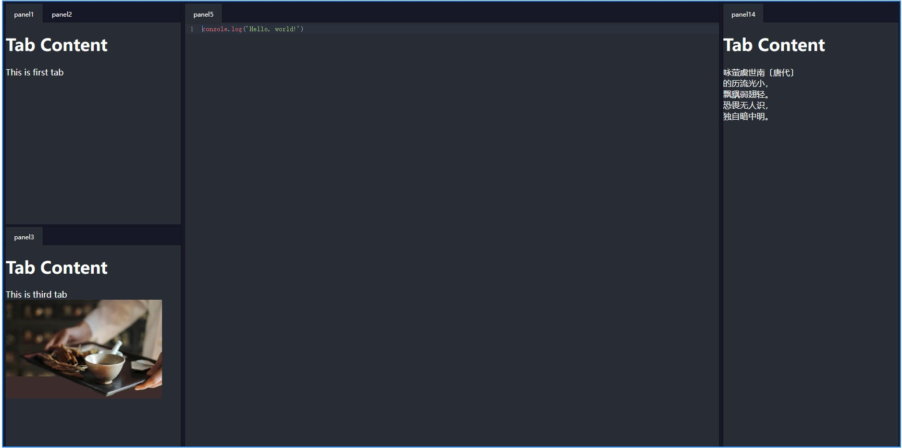
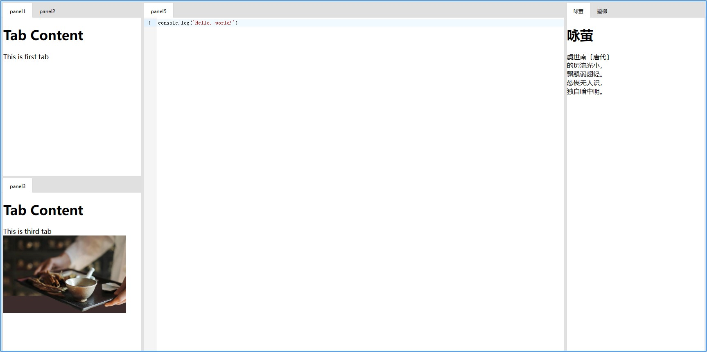

vue-dock-layout
---
A dock layout component like `visual studio` for Vue3



[中文说明](https://github.com/imengyu/vue-dock-layout/blob/main/README.CN.md)

---

[Click here View Documentation](https://imengyu.top/pages/vue-dock-layout-doc/en)

[Click here View online Demo](https://imengyu.top/pages/vue-dock-layout-demo/)

## Features

* Simple and easy to use, small size
* Customizable

### Install

```
npm install -save @imengyu/vue-dock-layout
```

## Useage

### Import

```ts
import { DockLayout, DockLayoutInterface } from '@imengyu/vue-dock-layout';   
```

### Make layoyt

To use vue dock layout, you need to first add a container component to your interface (`DockLayout`), which is the content hosting area of your application.

```html
<template>
  <DockLayout ref="dockLayout" class="full">
    <template #panelRender="{ panel }">
      <template v-if="panel.key==='panel1'">
        <h1>Tab Content</h1>
        <span>This is first tab</span>
      </template>
      <template v-else-if="panel.key==='panel2'">
        <h1>Tab Content</h1>
        <span>This is second tab</span>
      </template>
      <template v-else-if="panel.key==='panel3'">
        <h1>Tab Content</h1>
        <span>This is third tab</span>
        
      </template>
    </template>
  </DockLayout>
</template>
```

The layout of layout components is based on a grid layout, with each segmented area forming a grid, and your custom content is embedded in the grid.

The component provides some interfaces that allow you to quickly set the interface layout programmatically:

```ts
const dockLayout = ref<DockLayoutInterface>();

onMounted(() => {
  nextTick(() => {
    //Set the interface layout here first
    //Here we have added a horizontal layout with three areas, left/center/right, with a width ratio of 20%: 60%: 20%
    //Then the left region is divided into two regions: leftA/leftB, with a width of 50%: 50%
    dockLayout.value?.setData({
      name: 'root',
      size: 0,
      grids: [
        {
          size: 20,
          name: 'left',
          grids: [
            {
              size: 50,
              name: 'leftA',
            },
            {
              size: 50,
              name: 'leftB',
            },
          ]
        },
        {
          size: 60,
          name: 'center',
          //Here we set that the center area will not be automatically removed when there is no panel
          alwaysVisible: true,
        },
        {
          size: 20,
          name: 'right',
        },
      ],
    });
    //The code below adds a content window to the panel
    //Each content window is identified by a key, which can be read from the panel parameter in the panel render slot of DockLayout.
    dockLayout.value?.addPanels([
      {
        key: 'panel1',
        title: 'panel1',
      },
      {
        key: 'panel2',
        title: 'panel2',
      },
    ], 'leftA');
    dockLayout.value?.addPanels([
      {
        key: 'panel3',
        title: 'panel3',
      },
    ], 'leftB');
  })
});
```

The above examples can be found in [online Demo](https://imengyu.top/pages/vue-dock-layout-demo/). The first example in was found.

Users can customize the drag and drop interface. Therefore, when the program leaves, if you need to save the user's custom settings, you can read the current grid layout data, set it to the component the next time the program loads.

```js
onBeforeUnmount(() => {
  const layoutData = dockLayout.value?.getSaveData()
  //Save layoutData to anywhere...

  //Next time, load and set to dockLayout
  dockLayout.value?.setData(layoutData);
})
```

### Customize

#### Theme

The component default provides two themes for you to use: light and dark. The theme can be specified using the 'theme' attribute of the 'DockLayout' component.

```html
<DockLayout ref="dockLayout" theme="light">
  ...
</DockLayout>
```

The two theme effects are shown in the following figure:

|light|dark|
|---|---|
|||

#### Custom rendering

The component provides rendering slots in some locations that you can customize for rendering.

For specific examples and source code, please see [online Dome](https://imengyu.top/pages/vue-dock-layout-demo/#/DockLayoutThemeTest).

##### tabItemRender

Custom rendering for panel titles.

```vue
<DockLayout ref="dockLayout" class="full">
  <template #tabItemRender="{ dockData, panel, onTabItemMouseDown, onTabItemDragStart, onTabItemDragEnd }">
    <div
      :class="'my-custom-tab drag-target-tab ' + (dockData.activeTab === panel ? 'active' : '')"
      draggable="true" 
      @mousedown="onTabItemMouseDown($event, panel)"
      @dragstart="onTabItemDragStart($event, panel)"
      @dragend="onTabItemDragEnd($event)"
    >
      {{ panel.title }}
    </div>
  </template>
</DockLayout>
```

##### emptyPanel

This slot is used to render the backplane displayed when the panel has no content window.

```vue
<DockLayout ref="dockLayout" class="full">
  <template #emptyPanel="{ dockData }">
    <div>
      <h1>{{dockData.name}}</h1>
      <h1>This grid won't be removed from layout even when last Tab is closed</h1>
    </div>
  </template>
</DockLayout>
```

## Changelog

[Changelog](./CHANGELOG.md)

## Other projects of the author

* [vue3-context-menu A very simple context menu component for Vue3](https://github.com/imengyu/vue3-context-menu/)
* [vue-dynamic-form A data driven form component for vue3](https://github.com/imengyu/vue-dynamic-form)
